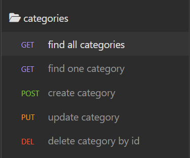
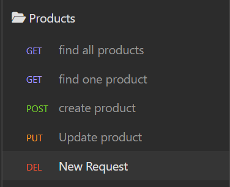
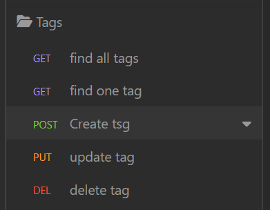

# E-Commerce Back-end
  
  ## Table of Contents:

  <a href="#Description">Description</a>
  <a href="#Installation">Installation</a>
  <a href="#Usage">Usage</a>
  <a href="#Contributing">Contributing</a>
  <a href="#Tests">Tests</a>
  <a href="#Questions/feedback">Questions/feedback</a>
  <a href="#License">License</a>

  ## Description
  
  This is a back-end application to keep track of inventory for an online shopping website.  Through the db, products are categorized and assigned tags to help with placement on the website.  
  
  ## Installation
  
  Download the folder and use the 'npm i' command in the terminal.  Once packages are installed, access mysql using the 'mysql -u <your username> -p' command and entering your password.  Navigate to the /db/schema.sql file and enter the commands into the terminal.  Return to the terminal by typing 'quit'.  Now enter the command 'npm run seed' to fill the database.  Once the data is seeded, the program is ready to run.

  ## Usage

  To use this application, open the folder in vscode and use the 'npm start' command in the terminal.  Open Insomnia or similar application to use the database.  Use routes to interface with the data in the Insomnia program using the endpoints described in the /routes folder.
  
  ## Contributing
  
  No contributions at this time, thank you.

  ## Tests

  Test this application by running the database and testing each route in Insomnia orsimilar program.  Check the find results against the seed data. Test all other routes by creating, updating, and deleting data you choose and watching any changes via the find routes.  

  ### Demos  

  Category routes:  
  

  Product routes:  
  

  Tag routes:  
  

  ## Questions/feedback

  Please log any issues and check out my projects on Github!  <a href='https://github.com/Wdiste'>Visit Github</a>

  To contact me with any questions, please send an email: <a href="mailto:wdiste49@gmail.com?subject=Feedback&body=Message)">Send Feedback</a>

  
  
